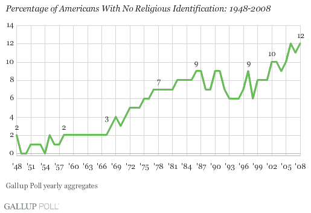
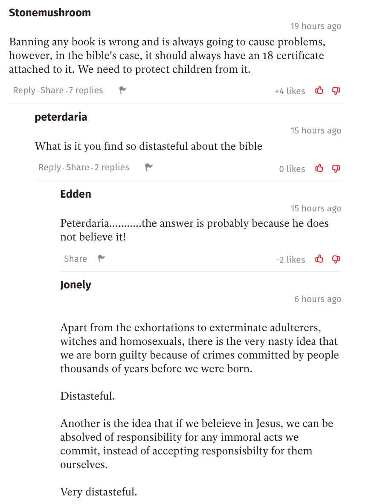
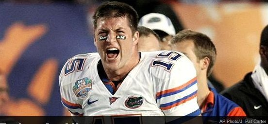
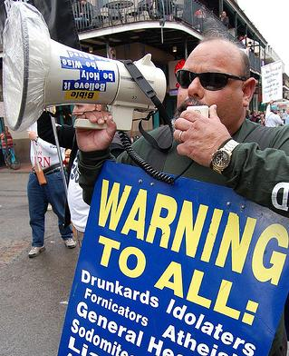
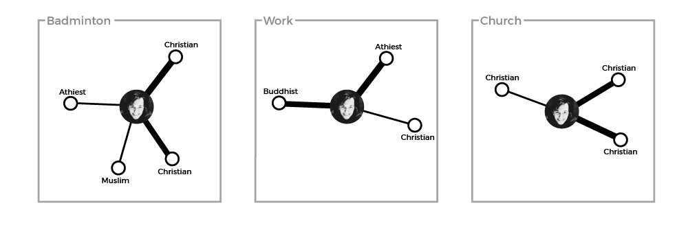
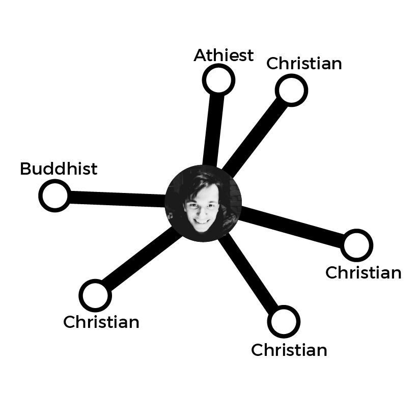
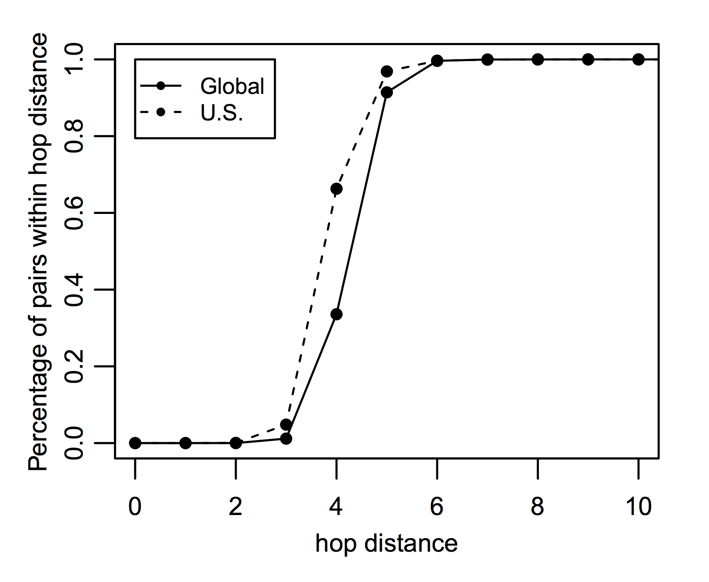

**How can we foster religious dialogue in a hyper-personalised online world?**

*Ravi Woods*

### Preface

In this draft, I seek to show a rough outline of what the final piece will be. In the Glossary, I show definitions for terms that may be unknown to a reader. I wasn't sure whether these definitions should be expanded in the text, however. The Introduction seems to be quite effective, and I imagine this will be fairly similar to the final piece. 

The main body of the text is a number of short essays, written from the perspective of different people who may shed light on the overall issue. At the moment it is just two, however I hope the final piece ends with six. The first will likely be from the perspective of an Atheist, a Christian and a Muslim (these are the three worldviews focused on in this text). The perspectives of the atheist and the muslim will need interviews with others, I feel, since I am not best qualified to speak on behalf of an atheist or a muslim without them.  Then the final three will be from the perspective of a Network Theorist, a Linguist, and a Journalist. I hope this approach is effective - do tell if it isn't. Of what is here, I think the section from the Christian is quite well formed, but the Network Theorist will need some tweaking I imagine.

Finally, I am still debating in my head whether a conclusion is necessary. Following convention, a conclusion would make sense to tie it together, however I feel that tying it together isn't necessarily the point; these are six different takes on one question. I would be interested in your thoughts on this. 

### Glossary

**Worldview**  
A theory of the natural (and supernatural) world, that can be expressed as set of beliefs which we hold about the basic construction of reality. This theory provides the foundation on which we live.

**Echo Chamber**  
An echo chamber is a community with little variance in opinion. It is a place where there is no desire, or a means, to access a different point of view.^1^

**Filter Bubbles ** 
Filters on the internet that fundamentally alter the way we encounter ideas and information, through hyper-personalisation of content. These can be found in news, social networks, search engines, and many other websites.

---

1. Thwaite, Alice. 2018. “A New Theory of Echo Chambers.” *The Echo Chamber Club* (blog). January 28, 2018. <https://echochamber.club/theory-echo-chambers/>.

 

### Introduction

Religion, whether you like it or not, is a huge influence on the world's population. While the number of people calling themselves athiests has increased, especially in the West, over the past half century (see Figure 1), it is difficult to deny to importance of religion in the public sphere. Over 80% of the world is religious, with Christians and Muslims making up over 50% of the world's population^2^. 

Figure 1: Graph showing the rise of Americans with no religious identification, from Gallup^3^

To those believers, their religion does not just affect their actions within a church or a mosque, but their religious beliefs make up a large part of their world view. Religion shapes thoughts. Therefore, it makes sense that understanding the religious beliefs of those around us is, in general, a useful thing to do. However, at times, we might think that discussing God or religion will be fruitless; that it will only end in debate, shouting and, ultimately, an impasse. Just look to any online comments section! (Figure 2)

Figure 2: A number of comments below an article on China's banning of the Bible, found in 5 minutes from browsing the front page of *The Independant*.^4^

But this is not a new issue. Herodotus, an Ancient Greek historian, tells of a similar impasse when two groups discuss burial customs over 2000 years ago:

> "When Darius was king, he summoned the Greeks who were with him and asked them what price would persuade them to eat their fathers’ dead bodies. They answered that there was no price for which they would do it. Then he summoned those Indians who are called Callatiae, who eat their parents, and asked them (the Greeks being present and understanding by interpretation what was said) what would make them willing to burn their fathers at death. The Indians cried aloud, that he should not speak of so horrid an act"^5^
>

Karl Popper, in *The Myth of the Framework*, rejects the notion that this confrontation was fruitless. While he agrees that "mutual understanding was not achieved"^6^, he points out that even without conversation, this confrontation can begin to breed tolerance and respect to those different from ourselves and, over time, this can bear fruit; the fruit of understanding ^7^. 

While this example is extreme, it is a picture you might be scared of. As you look at online comment sections, or at Richard Dawkins, or to Israel & Palestine, you might be put off by others' worldview. But these extreme examples are the ones that stick out most in our mind because we rarely actually see the beliefs and practices of those near us. One's worldview, almost by definition, affects the way we see life, and so affects what we do day-to-day. And yet, our clearest picture of someone practising Islam (or, at least, their version of Islam) is found in terrorist attacks, not in the practices of those close to us. The comedian Lee Mack makes this point, when being interviewed on the BBC Radio 4 show *Desert Island Discs*: 

> "I think it's quite odd that people like myself, in their forties, quite happy to dismiss the Bible, but I've never read it. I always think that if an alien came down and you were the only person they met, and they said, 'What's life about? What's earth about? Tell us everything,' and you said, 'Well, there's a book here that purports to tell you everything. Some people believe it to be true; some people [do] not believe it [to be] true.' 'Wow, what's it like?' and you go, 'I don't know, I've never read it.' It would be an odd thing wouldn't it?"^8^

Mack points out the attitude of dismissing the Bible without examining it is, at face value, an odd thing to do. While we may be scared off by the actions of the religious, or we feel constrained by the taboo religion holds, not bothering to ever look into it leaves us in the dark; we end up distancing ourselves from the people around us. 

As the Internet grew, people began to see it as a tool to bring people together; as a tool to solve this exact issue. Way back in 1993, internet theorist Michael Hauben wrote that "The Net brings the isolated individual into contact with people, opinions, and views from the rest of the world"^9^. This, he concludes, is an important aspect of the online world, since "exposure to many possible opinions gives the reader a chance to actually think something over before making a decision as to a personal opinion"^10^. 

However, as the internet grew, each user's journey through the online world was tailored just for them. Filter bubbles began to box us into clusters, rather than exposing us to the world's opinions. From social networks to search engines, the content we see was being categorized and personalised. Eli Pariser, chief executive of Upworthy, in his book *The Filter Bubble, *wrote that as "Google personalized for everyone, the query 'stem cells' might produce diametrically opposed results for scientists who support stem cell research and activists who oppose it"^11^.  When it comes to religion, then, how can we push back against this over-personalisation? How can we get back to an agora-like Internet, where the world can meaningfully discuss issues of religion, philosophy and worldview? In this piece, you will see a number of different ways of approaching this issue; a number of differing voices, much like the market place of ideas that the internet can offer. It is up to you to decide which are meaningful, and which are not.

---

2. Hackett, Conrad, and David McClendon. 2017. “Christians Remain World’s Largest Religious Group, but They Are Declining in Europe.” *Pew Research Center* (blog). April 5, 2017. <http://www.pewresearch.org/fact-tank/2017/04/05/christians-remain-worlds-largest-religious-group-but-they-are-declining-in-europe/>.
3. Gallup. n.d. “This Easter, Smaller Percentage of Americans Are Christian.” Gallup.Com. Accessed April 7, 2018. <http://news.gallup.com/poll/117409/Easter-Smaller-Percentage-Americans-Christian.aspx>.
4. Oppenheim, Maya. 2018. “China Cracks down on Sales of the Bible Online and in Bookshops.” The Independent. April 5, 2018. <http://www.independent.co.uk/news/world/asia/china-bible-ban-sales-online-bookshops-vatican-christianity-religion-freedom-a8290396.html>.
5. Herodotus, George Rawlinson, and Edward Henry Blakeney. 1910. *The History of Herodotus*. London: Dent.
6. Popper, Karl R., and M. A. Notturno. 1997. *The Myth of the Framework: In Defence of Science and Rationality*. Reprint. Philosophy. London: Routledge, pg37
7. ibid.
8. BBC Radio 4. 2013. “Desert Island Discs.” *Lee Mack*. <http://www.bbc.co.uk/programmes/b03bpxxq>, 42 minutes.
9. Hauben, Michael. 1993. “THE NET AND NETIZENS: The Impact the Net Has on People’s Lives.” 1993. <http://www.columbia.edu/~hauben/CS/netizen.txt>.
10. ibid.
11. Pariser, Eli. 2012. *The Filter Bubble: What the Internet Is Hiding from You*. London: Penguin Books.

 

### The Christian

Here, I want to address the Christian population. There is a tendency I have noticed, both online and offline, for Christians to bubble off into their own cliques and communities. In this piece, I seek to argue that this tendency is not one that comes from the Bible and, in fact, Christians should embrace an agora-like Internet as a chance to share their faith.

To achieve this, it makes sense to use the text that unites the Christian population - the gospels. These four books are four accounts of the life of the central figure of Christianity, so turning to these seems sensible. Here, for simplicity, we will use just two short sections from the gospel of John. While there is little context in these texts, both support one another in what they say. The first is chapter 3 verse 16, likely the most famous verse from John's gospel, often seen around stadiums during American sports games. The verse itself is a clear and concise description of Christ's role in the faith: 

> "For God so loved the world that he gave his one and only Son, that whoever believes in him shall not perish but have eternal life."^12^

Figure 3: American footballer Tim Tebow, with John 3:16 painted below his eye during a playoff game 

The second is chapter 30, verses 30 and 31. This comes near the end of the gospel, and is an explanation by John as to why he curated the signs (that is, miracles) of Jesus the way he did:

> "Jesus performed many other signs in the presence of his disciples, which are not recorded in this book. But these are written that you may believe that Jesus is the Messiah, the Son of God, and that by believing you may have life in his name."^13^

From these two verses we see three beliefs central to the Christian faith: 

1. God has one son, Jesus, who he gave to the world. 
2. This son, Jesus, is messianic. That is to say, he is some sort of saviour figure in Christianity. 
3. If you believe in Jesus as the Messiah, and as God's Son, you can have eternal life in his name.

The important belief to us here is the third. It is clear that belief in Jesus is important to Christians; to believe in Jesus is to gain access to an everlasting life after this one. Then, for the Christian, the role of dialogue is to help others to know and understand Jesus. Some may call this dialogue proselytizing. However, proselytizing brings up images of megaphones on street corners; proselytizing is coercive and pushy. Dialogue, on the other hand, is the Christian sharing their faith, answering questions and so forth, in order to help people make up their mind about Jesus properly. So, when Jesus says to "love your neighbor as yourself"^14^ in Matthew's Gospel, I would call this form of dialogue more loving than the man shouting on the street corner.

Figure 4: A street preacher with a megaphone.

However, I would argue, to not share your faith as a Christian is also an unloving act. In doing this, the Christian believes that they have eternal life, yet they don't want anyone around them to have that life also. Penn Jillette, Las Vegas magician and advocate for atheism, agrees with this sentiment. In a video on the subject he said this:

> "If you believe there is a heaven and hell, and people could be going to hell or not getting eternal life or whatever, and you think it’s not really worth telling them this because it would make it socially awkward...How much do you have to hate somebody to not [tell them]?" ^15^

When we look online though, we see that it is easy for anyone, Christian included, to stay in a bubble online. Eli Parisier, in *The Filter Bubble*, says that these exist because of the personalisation algorithms found across the web. However, Parisier says, the bubble is "a cozy place, populated by our favorite people and things and ideas" ^16^. Ultimately, like anyone, Christians can be scared of what people will think of them, and they don't like being challenged. In addition, with religion specifically, this issue isn't solely who you engage with on Facebook; almost all your media consumption can be within a Christian bubble. At a conference, Mark Scott, the Former Managing Director of the Australian Broadcasting Corporation, explained the issue as follows:

> “The new media environment presents a great risk for Christians to retreat. There will be in a media sense, a massive global market for Christians to listen to Christian music, to read Christian books, to see Christian films, to partake in Christian blogs, to comment on each other’s Christian Facebook pages and to live in that Christian world." ^17^

For Christians then, there is tremendous comfort in staying within the bubble, and there is enough media to allow you to stay there for as long as you want to. Thus there seems to be a clash in the minds of Christians, between (somewhat selfishly) staying within the bubble, and (more selflessly) sharing your faith for the sake of those around you. 

This clash can be seen in a 2017 study by Brubaker and Haigh^18^. In the study, 335 Christians participated in an online study about their engagement in religious content and community online. With regards to how much Christians see Facebook as a platform for dialogue, they found that "those who use [Facebook] for religious purposes recognize the potential for visibility and therefore reach out to people with diverse beliefs and varying commitments to those beliefs"^19^. However a second, more interesting insight is that "people who were more religious were also more likely to minister to others online"^20^. This seems to back our hypothesis above; those who are more religious are more certain of an everlasting life after this one, so will think it more crucial to try to tell people about Jesus, and that new life. In contrast, those who are less sure themselves, are more likely attracted to the comfort the bubble provides, rather than sticking their neck out for the sake of those around them. 

So, from this, we have seen that the Bible backs up the case for dialogue (rather than proselytizing), and yet Christians are conflicted. On the one hand, they want to start a dialogue out of a sense of love for those around them. Yet, there is comfort in staying still, and dangers (either percieved or real) of sharing their faith online. It is my opinion, then, that we need to teach Christians what the Bible says about dialogue. As online personalisation seems to be only getting stronger, Christians will have a tendency to clump together,  unless we can help them understand why that tendency is an unbiblical one.

---

12. *The Holy Bible: New International Version*. 2007. Grand Rapids MA, USA: Zondervan, pg 1035.
13. ibid., pg 1057.
14. ibid., pg 956.
15. Jillette, Penn. 2010. *The Gift of a Bible*. Best of Penn Says: Religion. Sony Pictures. <https://www.youtube.com/watch?v=6md638smQd8&feature=youtu.be>.
16. Pariser, Eli. 2012. *The Filter Bubble: What the Internet Is Hiding from You*. London: Penguin Books, pg 12.
17. Taylor, Sophie. 2014. “Mark Scott to Christians: Beware the Christian Bubble.” *Bible Society*. March 19, 2014. <https://www-archive.biblesociety.org.au/news/mark-scott-christians-beware-christian-bubble>.
18. Brubaker, Pamela Jo, and Michel M. Haigh. 2017. “The Religious Facebook Experience: Uses and Gratifications of Faith-Based Content.” *Social Media + Society* 3 (2): 205630511770372. <https://doi.org/10.1177/2056305117703723>.
19. ibid., pg 8.
20. ibid, pg 6.

 

### The Network Theorist

'Birds of a feather flock together" as the saying goes. This is homophily; the tendency of individuals to associate with those similar to them. While homophily is hardly a new concept, the dawn of social networks provided an extensive dataset to study the area. In 2008, Thelwall looked at a sample of 2,567 members of Myspace to see patterns of behaviour^21^. While he found no evidence of homophily within genders, he found significant evidence of homophily in many other areas, including within religions^22^. However, social networks do more than just provide data; they change the very nature of the connection between members within the network. In this piece, I seek to show that individual tendency, coupled with the structure of social networks (looking at Facebook specifically), only seeks to clump people together. In addition, I propose two possible areas that could successfully push back against this model.

In *The Filter Bubble*, Parisier says that online filter bubbles "tend to dramatically amplify confirmation bias"^23^. Since we naturally become frustrated by information that challenges our assumptions, we tend to instead drift towards information that we agree with. Thus, we have a tendency toward those who hold a similar viewpoint to us; those of the same religion, or even of the same denomination within that religion. And, since online filter bubbles personalise, they amplify things we have a tendency towards, so amplifying this confirmation bias^24^. 

But how does this compare to the offline world of homophily? Take the example of stratified housing communities, where the rich and the poor live in different districts. Each district is like it's own filter bubble, amplifying confirmation bias within it. However, the difference lies in the fact that each member is not confined to their own district. Naturally, people live in different contexts, and move between these contexts daily. While these contexts may be related (those who are rich may have different hobbies to those who are poor), each context is skewed in different ways (as can be seen in Figure 5). So, while your affinity toward certain people still exists (as seen by the thickness of the lines in the figure), you end up interacting with people from different religious beliefs. 

Figure 5: Offline contexts of a Christian, with affinity toward a person indicated by line thickness

In the offline world, however, you hold one identity - one profile. Facebook founder, Mark Zuckerberg told journalist David Kirkpatrick for his book *The Facebook Effect:* 

> "The days of you having a different image for your work friends or coworkers and for the other people you know are probably coming to an end pretty quickly."^25^

So it makes sense that, on Facebook, there is one context where you have no direct control. And, when all the contexts are aggregated (see Figure 6), online filter bubbles amplify those you have an affinity for. We see then that, online, your feed becomes skewed towards views similar to you in a different way to the offline world. 

Figure 6: The aggregation of offline contexts onto a single online profile. Now, affinity towards other Christians shows up much more starkly, since these are the only people you see in your feed.

However, within this network, it might seem surprising that the number of hops between you and every other member is actually very small. In a 2011 analysis of the Facebook network, they found that 99.6% of users are connected in 6 links or less, with the average distance being 4.7 links^26^, as seen in the graph in Figure 7. At the same time, though, they found that the amount of clustering in Facebook is very high. In the literature, clustering is measured as a coefficient between 0 and 1. A coefficient of 1 indicates that all of your friends are also friends with each other. In the 2011 analysis, they concluded that "for users with 100 friends, the average local clustering coefficient is 0.14, indicating that for a median user, 14% of all their friend pairs are themselves friends"^28^. This coefficient as found to be "five times greater than the clustering coefficient found in a 2008 study analyzing the graph of MSN messenger correspondences, for the same neighborhood size" ^29^. 

Figure 7: Graph showing the percentage of user pairs that are within *h* hops of each other, from Ugander et al.^27^

This apparent contradiction is explained by a seminal paper by Strogatz and Watts^30^. Here they called these networks, with a high amount of clustering and a small average path length, 'small-worlds' networks^31^. These networks are "caused by the introduction of a few long-range edges"^32^; individuals who have a supremely large number of links within the network. These individuals, who we will call 'hubs', become the 'glue' between disparate clusters. So, then, one approach to stop over-personalisation might be to harness the power of these hubs. While clustering is very high within the network, the 2011 study found an interesting insight when studying friends-of-friends. While you would expect the average user with 100 friends to have "100∗99 = 9,900 non-unique friends-of-friends"^33^, they found that they have far more than that; "27,500 unique friends-of-friends and 40,300 non-unique friends-of-friends"^34^. This is likely due to the these hubs in the network. While most of your friends will have a similar number of friends as you, a small number are incredibly well-connected, which explains why you have so many more friends-of-friends than expected. 

However, rather than playing this up, social networks tend to play this down. Parisier, in *The Filter Bubble*, looked at Twitter. He found that:

> "Twitter users see most of the tweets of the folks they follow, but if my friend is having an exchange with someone I don’t follow, it doesn’t show up. The intent is entirely innocuous: Twitter is trying not to inundate me with conversations I’m not interested in. But the result is that conversations between my friends (who will tend to be like me) are overrepresented, while conversations that could introduce me to new ideas are obscured."^35^

So, then, one method would be to push against this shift within our social networks, by allowing users to see interactions between their friends and people they don't know, to give a springboard for conversation with those outside your immediate cluster.

Coming back to contexts, a second method could be to split the internet back into different contexts, while Facebook (among others) tend to group them together. An example is the forum site Reddit, where there are a number of smaller forums (called subreddits). The front page of the subreddits you join are aggregated, to form your feed. The difference with this compared to Facebook, for example, is that your feed is not altered based on which subreddits you look at regularly, so your experience is much more broad.

The issue here is one of framing. Imagine a user joins the subreddit for badminton players, and the subreddit for Christians. This may not seem like a problem, because these two communities are disparate; badminton players are religiously diverse, and Christians play a lot of different sports. However, subreddits are framed in a certain way; the badminton subreddit is devoted to badminton, and the Christianity subreddit is devoted to Christianity. Almost by definition, discussion on the badminton subreddit is devoted to badminton, while discussion on Facebook with your badminton friends, on the other hand, can be diverse. This is likely because you are more comfortable around those friends you play badminton with in the offline world; you know them personally, and so want to find out about their life as a whole. However, the same cannot be said about faceless users of a badminton forum. 

The conclusion then might be to create new contexts online. A good example is the DebateReligion subreddit^36^, where users (you guessed it) discuss and debate religious topics, or ChangeMyView^37^, a more general subreddit for discussing perspectives on different opinions. These subreddits are designed as agora-like forums, to discuss and debate ideas. It is a rosy picture, but the issue here is one of size. While ChangeMyView and DebateReligion have roughly 600,000 combined subscribers, there are over 2 billion active Facebook users^38^. The user base of these subreddits make up just 0.03% of the user base of Facebook. However, the model of specific communities of strangers dedicated to understanding one another is a useful one. 

Parisier proposes a happy medium between the ghetto-like model of Facebook and the agora-like model of Reddit. Comparing the internet to a city, he says that "we need our online urban planners to strike a balance between relevance and serendipity, between the comfort of seeing friends and the exhilaration of meeting strangers, between cozy niches and wide open spaces"^39^. The network structure of Facebook is flawed; it clumps all those you know together, and then amplifies the connection you feel towards those who hold the same beliefs you do. It creates, as Parisier says, a "city of ghettos"^40^. However, either by context splitting, or by harnessing the power of hubs in the network, we can strive to create a better city, where internet citizens are given a space to think and discuss the most important questions of human existence.

---

21. Thelwall, Mike. 2009. “Homophily in MySpace.” *Journal of the American Society for Information Science and Technology* 60 (2): 219–31. <https://doi.org/10.1002/asi.20978>, pg 219.
22. ibid., pg 229
23. Pariser, Eli. 2012. *The Filter Bubble: What the Internet Is Hiding from You*. London: Penguin Books, pg 88
24. ibid.
25. Kirkpatrick, David. 2011. *The Facebook Effect: The Inside Story of the Company That Is Connecting the World*. 1st Simon & Schuster trade pbk. ed. New York: Simon & Schuster Paperbacks, 199
26. Ugander, Johan, Brian Karrer, Lars Backstrom, and Cameron Marlow. 2011. “The Anatomy of the Facebook Social Graph.” *ArXiv:1111.4503 [Cs.SI]*, November. <http://arxiv.org/abs/1111.4503>, pg4-5.
27. ibid., pg 4, figure 2.
28. ibid., pg 6
29. ibid.
30. Watts, Duncan J., and Steven H. Strogatz. 1998. “Collective Dynamics of ‘Small-World’ Networks.” *Nature* 393 (6684): 440–42. <https://doi.org/10.1038/30918>.
31. ibid., pg 440
32. ibid., pg 440
33. Ugander, Johan, Brian Karrer, Lars Backstrom, and Cameron Marlow. 2011. “The Anatomy of the Facebook Social Graph.” *ArXiv:1111.4503 [Cs.SI]*, November. <http://arxiv.org/abs/1111.4503>, pg8.
34. ibid.
35. Pariser, Eli. 2012. *The Filter Bubble: What the Internet Is Hiding from You*. London: Penguin Books, pg 150
36. “DebateReligion.” n.d. Reddit. Accessed April 8, 2018. <https://www.reddit.com/r/DebateReligion/>.
37. “Change My View (CMV).” n.d. Reddit. Accessed April 8, 2018. <https://www.reddit.com/r/changemyview/>.
38. Statista. n.d. “Facebook Users Worldwide: 2017.” Statista: The Statistics Portal. Accessed April 8, 2018. <https://www.statista.com/statistics/264810/number-of-monthly-active-facebook-users-worldwide/>.
39. Pariser, Eli. 2012. *The Filter Bubble: What the Internet Is Hiding from You*. London: Penguin Books, pg 222
40. ibid.

 

## The Nutrionist

We consume our news like gluttons. We gorge ourselves with the junk food of the newsroom - a new sex tape, or the newest celebrity spat. The scholar Danah Boyd chalks this up to our biology, saying that we're "programmed to be attentive to things that stimulate: content that is gross, violent, or sexual and that gossip which is humiliating, embarrassing, or offensive". Just like we crave fatty 

As
sociologist Danah Boyd said in a speech at the 2009 Web 2.0 Expo "Our
bodies are programmed to consume fat and sugars because they’re rare in nature.
In the same way, we’re biologically programmed to be attentive to things that
stimulate: content that is gross, violent, or sexual and that gossip which is
humiliating, embarrassing, or offensive. If we’re not careful, we’re going to
develop the psychological equivalent of obesity. We’ll find ourselves consuming
content that is least beneficial for ourselves or society as a whole."

Can we use the dirth of research that looks at how we get people to eat healthier here?

Knowledge in necessary for change, however is insufficient in and of itself
"some nutrition knowledge appears to be a necessary but insufficient prerequisite for health behaviour change."INCLI Brug
"Public information campaigns have been successful in raising awareness of unhealthy eating and its consequences but less successful in translating the message into action."INCLI Brambila-Macias pg373

With unhealthy eating, information campaigns are prevalent. However, there are few campaigns to go against these bubbles (maybe they will with the fb issues). In traditional media, consumer often choose newspapers based on political leanings. However, they at least know the leaning of the paper their reading. Online, personalization algorithms are opaque, making it difficult to know how content is being filttered to you.

Self-awareness (calorie counting) works. "Studies have shown that awareness of unhealthy eating habits is a strong positive correlate of intentions to make dietary changes" INCLI Brug

Examples of similar self-awareness techniques are seen online. FlipFeed, PolitiEcho

A second side to the story is environmental.

Firstly, parents

"parents have a crucial role in the nutrition behaviours of their children. They should not only provide a good example by eating right themselves but also by using parenting practices and styles that encourage and support healthy eating habits in their offspring"

Growing up Christian, Growing up Atheist

availability and accessibility of healthy and less healthy foods are important for nutrition behaviours in youth and adulthood; schools and worksites offer good opportunities to improve availability of healthful foods

Schools 

Workplaces

### Biblography

Abdel-Fadil, Mona. 2017a. “Feeling so Emotional: Why We Rage about Religion on Facebook.” Religion: Going Public. January 8, 2017. <http://religiongoingpublic.com/archive/2017/feeling-so-emotional-religion-and-rage-on-facebook>.

Abdel-Fadil, Mona. 2017b. “Whispering, Whimpering, and Wailing about Religion on Facebook.” Religion: Going Public. May 22, 2017. <http://religiongoingpublic.com/archive/2017/whispering-whimpering-and-wailing-about-religion-on-facebook>.

BBC Radio 4. 2013. “Desert Island Discs.” *Lee Mack*. <http://www.bbc.co.uk/programmes/b03bpxxq>.

Berger, Jonah, and Katherine L Milkman. 2012. “What Makes Online Content Viral?” *Journal of Marketing Research* 49 (2): 192–205. <https://doi.org/10.1509/jmr.10.0353>.

Bohm, David, and Lee Nichol. 2004. *On Dialogue*. Routlege cCassics ed. Routledge Classics. London ; New York: Routledge.

Brubaker, Pamela Jo, and Michel M. Haigh. 2017. “The Religious Facebook Experience: Uses and Gratifications of Faith-Based Content.” *Social Media + Society* 3 (2): 205630511770372. <https://doi.org/10.1177/2056305117703723>.

Gallup. n.d. “This Easter, Smaller Percentage of Americans Are Christian.” Gallup.Com. Accessed April 7, 2018. <http://news.gallup.com/poll/117409/Easter-Smaller-Percentage-Americans-Christian.aspx>.

Glover, Jonathan. n.d. “Ideological Conflict, Philosophy and Dialogue.” A Philosophy Website. Accessed April 7, 2018. <http://www.jonathanglover.co.uk/conflicts/i-conflict>.

Google. n.d. “Google Trends.” Google Trends. Accessed March 29, 2018. <https://g.co/trends/OhPuj>.

Guadagno, Rosanna E., Daniel M. Rempala, Shannon Murphy, and Bradley M. Okdie. 2013. “What Makes a Video Go Viral? An Analysis of Emotional Contagion and Internet Memes.” *Computers in Human Behavior* 29 (6): 2312–19. <https://doi.org/10.1016/j.chb.2013.04.016>.

Hackett, Conrad, and David McClendon. 2017. “Christians Remain World’s Largest Religious Group, but They Are Declining in Europe.” *Pew Research Center* (blog). April 5, 2017. <http://www.pewresearch.org/fact-tank/2017/04/05/christians-remain-worlds-largest-religious-group-but-they-are-declining-in-europe/>.

Hart, Vi, and Nicky Case. n.d. “Parable of the Polygons.” Parable of the Polygons. Accessed April 2, 2018. <http://ncase.me/polygons>.

Hauben, Michael. 1993. “THE NET AND NETIZENS: The Impact the Net Has on People’s Lives.” 1993. <http://www.columbia.edu/~hauben/CS/netizen.txt>.

Herodotus, George Rawlinson, and Edward Henry Blakeney. 1910. *The History of Herodotus*. London: Dent.

Jillette, Penn. 2010. *The Gift of a Bible*. Best of Penn Says: Religion. Sony Pictures. <https://www.youtube.com/watch?v=6md638smQd8&feature=youtu.be>.

Kirkpatrick, David. 2011. *The Facebook Effect: The inside Story of the Company That Is Connecting the World*. 1st Simon & Schuster trade pbk. ed. New York: Simon & Schuster Paperbacks.

Marwick, Alice. 2013. “Memes.” *Contexts* 12 (4): 12–13. <https://doi.org/10.1177/1536504213511210>.

Oppenheim, Maya. 2018. “China Cracks down on Sales of the Bible Online and in Bookshops.” The Independent. April 5, 2018. <http://www.independent.co.uk/news/world/asia/china-bible-ban-sales-online-bookshops-vatican-christianity-religion-freedom-a8290396.html>.

Pariser, Eli. 2012. *The Filter Bubble: What the Internet Is Hiding from You*. London: Penguin Books.

Popper, Karl R., and M. A. Notturno. 1997. *The Myth of the Framework: In Defence of Science and Rationality*. Reprint. Philosophy. London: Routledge.

Putnam, Robert D. 2000. *Bowling Alone: The Collapse and Revival of American Community*. New York: Simon & Schuster.

Shelling, Thomas C. n.d. “Dynamic Models of Segregation.” *The Journal of Mathematical Sociology* 1 (2). Accessed April 7, 2018. <https://www.tandfonline.com/doi/abs/10.1080/0022250X.1971.9989794>.

Taylor, Sophie. 2014. “Mark Scott to Christians: Beware the Christian Bubble.” *Bible Society* (blog). March 19, 2014. <https://www-archive.biblesociety.org.au/news/mark-scott-christians-beware-christian-bubble>.

*The Holy Bible: New International Version*. 2007. Grand Rapids MA, USA: Zondervan.

Thelwall, Mike. 2009. “Homophily in MySpace.” *Journal of the American Society for Information Science and Technology* 60 (2): 219–31. <https://doi.org/10.1002/asi.20978>.

Thwaite, Alice. 2018. “A New Theory of Echo Chambers.” *The Echo Chamber Club* (blog). January 28, 2018. <https://echochamber.club/theory-echo-chambers/>.

Thwaite, Alice, and Jazza John. 2018. “Can Polarisation Be Eroded by Design?” OpenDemocracy. January 9, 2018. <https://www.opendemocracy.net/transformation/alice-thwaite-jazza-john/can-polarisation-be-eroded-by-design>.

Ugander, Johan, Brian Karrer, Lars Backstrom, and Cameron Marlow. 2011. “The Anatomy of the Facebook Social Graph.” *ArXiv:1111.4503 [Cs.SI]*, November. <http://arxiv.org/abs/1111.4503>.

Watts, Duncan J., and Steven H. Strogatz. 1998. “Collective Dynamics of ‘Small-World’ Networks.” *Nature* 393 (6684): 440–42. <https://doi.org/10.1038/30918>.

