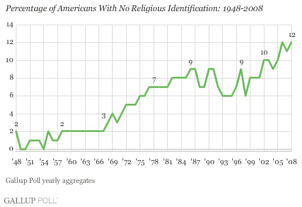
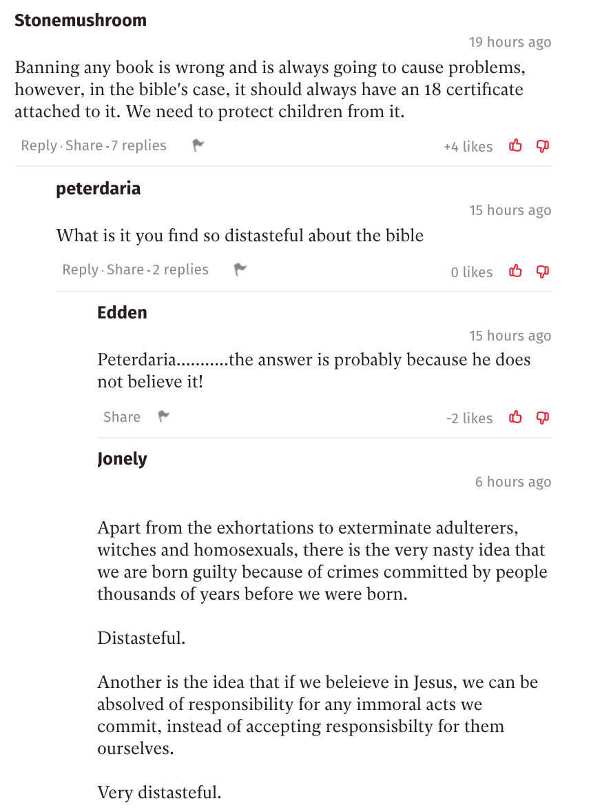
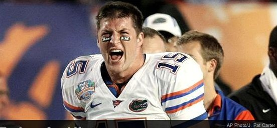
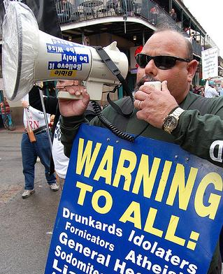
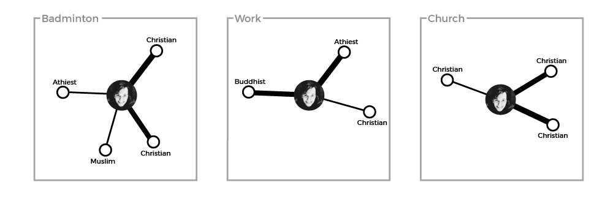
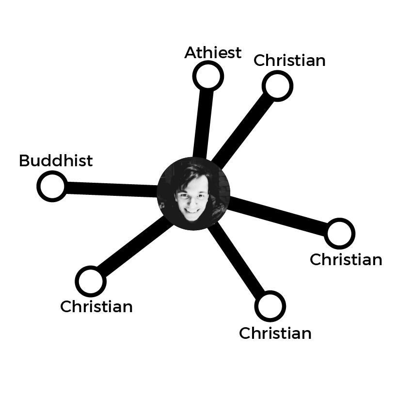

**Religion without a Row: Facilitating Positive Religious Dialogue Online**

---

**Glossary**

**Worldview**  
A theory of the natural (and supernatural) world, that can be expressed as set of beliefs which we hold about the basic construction of reality. This theory provides the foundation on which we live.

**Echo Chamber**  
An echo chamber is a community with little variance in opinion. It is a place where there is no desire, or a means, to access a different point of view.\autocite{Thwaitenewtheoryecho2018}

**Filter Bubbles ** 
Filters on the internet that fundamentally alter the way we encounter ideas and information, through hyper-personalisation of content. These can be found in news, social networks, search engines, and many other websites.

---

**Background**

When approaching this topic, we need to have background into two areas; the landscape of religious beliefs, and the landscape of the online world. We will take each in turn. Worldwide, over 80% of the world is religious, with Christians and Muslims making up over 50% of the world's population\autocite{HackettChristiansremainworld2017}. However, it is important to note that this does not mean 80% of the world is committed to their faith. The terms 'culturally Muslim' or 'culturally Christian' have been used to describe these individuals. And they can be surprisingly common. In a study on Islam by the Pew Research centre, 

As the Internet grew, people began to see it as a tool to bring people together; as a tool to solve this exact issue. Way back in 1993, internet theorist Michael Hauben wrote that "The Net brings the isolated individual into contact with people, opinions, and views from the rest of the world"^9^. This, he concludes, is an important aspect of the online world, since "exposure to many possible opinions gives the reader a chance to actually think something over before making a decision as to a personal opinion"^10^. 

However, as the internet grew, each user's journey through the online world was tailored just for them. Filter bubbles began to box us into clusters, rather than exposing us to the world's opinions. From social networks to search engines, the content we see was being categorized and personalised. Eli Pariser, chief executive of Upworthy, in his book *The Filter Bubble, *wrote that as "Google personalized for everyone, the query 'stem cells' might produce diametrically opposed results for scientists who support stem cell research and activists who oppose it"^11^.  When it comes to religion, then, how can we push back against this over-personalisation? How can we get back to an agora-like Internet, where the world can meaningfully discuss issues of religion, philosophy and worldview? In this piece, you will see a number of different ways of approaching this issue; a number of differing voices, much like the market place of ideas that the internet can offer. It is up to you to decide which are meaningful, and which are not.

---

**Introduction**

Religion, whether you like it or not, is a huge influence on the world's population. While the number of people calling themselves athiests has increased, especially in the West, over the past half century (see Figure 1), it is difficult to deny to importance of religion in the public sphere. Over 80% of the world is religious, with Christians and Muslims making up over 50% of the world's population\autocite{HackettChristiansremainworld2017}. Whether positively or negatively, it is difficult to deny that these beliefs effect our society as a whole; our art, culture, entertainment, laws and politics are all markedly changed by religious values. Even though portions of the world's religious population are only culturally so (as discussed in Section 1), these religions still have an affect on these individuals. And for those who are devout believers, the religion does not just affect their actions within a church or a mosque - but their day-to-day actions and thoughts also. 

And yet, our clearest picture of someone practising Islam, for example, is often found in suicide bombers, rather than in the practices of those close to us. The comedian Lee Mack makes this point, when being interviewed on the BBC Radio 4 show *Desert Island Discs*: 

> "I think it's quite odd that people like myself, in their forties, quite happy to dismiss the Bible, but I've never read it. I always think that if an alien came down and you were the only person they met, and they said, 'What's life about? What's earth about? Tell us everything,' and you said, 'Well, there's a book here that purports to tell you everything. Some people believe it to be true; some people [do] not believe it [to be] true.' 'Wow, what's it like?' and you go, 'I don't know, I've never read it.' It would be an odd thing wouldn't it?"\autocite{BBCRadio4DesertIslandDiscs13}

Mack points out the attitude of dismissing the Bible without examining it is, at face value, an odd thing to do. While we may be scared off by the actions of the religious, or we feel constrained by the taboo religion holds, not bothering to ever look into it leaves us in the dark; we end up distancing ourselves from the people around us. 

However, at times, we might think that discussing God or religion will be fruitless; that it will only end in debate, shouting and, ultimately, an impasse. Just look to any online comments section! (Figure 2)

But this is not a new issue. Herodotus, an Ancient Greek historian, tells of a similar impasse when two groups discuss burial customs over 2000 years ago:

> "When Darius was king, he summoned the Greeks who were with him and asked them what price would persuade them to eat their fathers’ dead bodies. They answered that there was no price for which they would do it. Then he summoned those Indians who are called Callatiae, who eat their parents, and asked them (the Greeks being present and understanding by interpretation what was said) what would make them willing to burn their fathers at death. The Indians cried aloud, that he should not speak of so horrid an act"\autocite{HerodotusHistoryHerodotus1910}
>

Karl Popper, in *The Myth of the Framework*, rejects the notion that this confrontation was fruitless. While he agrees that "mutual understanding was not achieved"\autocite[pg 37]{PopperMythFrameworkdefence1997}, he points out that even without conversation, this confrontation can begin to breed tolerance and respect to those different from ourselves and, over time, this can bear fruit; the fruit of understanding\autocite{PopperMythFrameworkdefence1997}. 

**Why understanding religious thought is important to stop this kind of dialogue**  

**How internet can help not hinder**

**Format of the dissertation**  

---

**The Christian**

Here, I want to address the Christian population. There is a tendency I have noticed, both online and offline, for Christians to bubble off into their own cliques and communities. In this piece, I seek to argue that this tendency is not one that comes from the Bible and, in fact, Christians should embrace an agora-like Internet as a chance to share their faith.

To achieve this, it makes sense to use the text that unites the Christian population - the gospels. These four books are four accounts of the life of the central figure of Christianity, so turning to these seems sensible. Here, for simplicity, we will use just two short sections from the gospel of John. While there is little context in these texts, both support one another in what they say. The first is chapter 3 verse 16, likely the most famous verse from John's gospel, often seen around stadiums during American sports games. The verse itself is a clear and concise description of Christ's role in the faith: 

> "For God so loved the world that he gave his one and only Son, that whoever believes in him shall not perish but have eternal life."\autocite[pg 1035]{HolyBibleNew2007}

The second is chapter 30, verses 30 and 31. This comes near the end of the gospel, and is an explanation by John as to why he curated the signs (that is, miracles) of Jesus the way he did:

> "Jesus performed many other signs in the presence of his disciples, which are not recorded in this book. But these are written that you may believe that Jesus is the Messiah, the Son of God, and that by believing you may have life in his name."\autocite[pg 1057]{HolyBibleNew2007}

From these two verses we see three beliefs central to the Christian faith: 

1. God has one son, Jesus, who he gave to the world. 
2. This son, Jesus, is messianic. That is to say, he is some sort of saviour figure in Christianity. 
3. If you believe in Jesus as the Messiah, and as God's Son, you can have eternal life in his name.

The important belief to us here is the third. It is clear that belief in Jesus is important to Christians; to believe in Jesus is to gain access to an everlasting life after this one. Then, for the Christian, the role of dialogue is to help others to know and understand Jesus. Some may call this dialogue proselytizing. However, proselytizing brings up images of megaphones on street corners; proselytizing is coercive and pushy. Dialogue, on the other hand, is the Christian sharing their faith, answering questions and so forth, in order to help people make up their mind about Jesus properly. So, when Jesus says to "love your neighbor as yourself"\autocite[pg 956]{HolyBibleNew2007} in Matthew's Gospel, I would call this form of dialogue more loving than the man shouting on the street corner.

However, I would argue, to not share your faith as a Christian is also an unloving act. In doing this, the Christian believes that they have eternal life, yet they don't want anyone around them to have that life also. Penn Jillette, Las Vegas magician and advocate for atheism, agrees with this sentiment. In a video on the subject he said this:

> "If you believe there is a heaven and hell, and people could be going to hell or not getting eternal life or whatever, and you think it’s not really worth telling them this because it would make it socially awkward...How much do you have to hate somebody to not [tell them]?" \autocite{JilletteGiftBible2010}

When we look online though, we see that it is easy for anyone, Christian included, to stay in a bubble online. Eli Parisier, in *The Filter Bubble*, says that these exist because of the personalisation algorithms found across the web. However, Parisier says, the bubble is "a cozy place, populated by our favorite people and things and ideas"\autocite[pg 12]{PariserFilterBubblewhat2012}. Ultimately, like anyone, Christians can be scared of what people will think of them, and they don't like being challenged. In addition, with religion specifically, this issue isn't solely who you engage with on Facebook; almost all your media consumption can be within a Christian bubble. At a conference, Mark Scott, the Former Managing Director of the Australian Broadcasting Corporation, explained the issue as follows:

> “The new media environment presents a great risk for Christians to retreat. There will be in a media sense, a massive global market for Christians to listen to Christian music, to read Christian books, to see Christian films, to partake in Christian blogs, to comment on each other’s Christian Facebook pages and to live in that Christian world."\autocite{TaylorMarkScottChristians2014}

For Christians then, there is tremendous comfort in staying within the bubble, and there is enough media to allow you to stay there for as long as you want to. Thus there seems to be a clash in the minds of Christians, between (somewhat selfishly) staying within the bubble, and (more selflessly) sharing your faith for the sake of those around you. 

This clash can be seen in a 2017 study by Brubaker and Haigh\autocite{BrubakerReligiousFacebookExperience2017}. In the study, 335 Christians participated in an online study about their engagement in religious content and community online. With regards to how much Christians see Facebook as a platform for dialogue, they found that "those who use [Facebook] for religious purposes recognize the potential for visibility and therefore reach out to people with diverse beliefs and varying commitments to those beliefs"\autocite[pg 8]{BrubakerReligiousFacebookExperience2017}. However a second, more interesting insight is that "people who were more religious were also more likely to minister to others online"\autocite[pg 9]{BrubakerReligiousFacebookExperience2017}. This seems to back our hypothesis above; those who are more religious are more certain of an everlasting life after this one, so will think it more crucial to try to tell people about Jesus, and that new life. In contrast, those who are less sure themselves, are more likely attracted to the comfort the bubble provides, rather than sticking their neck out for the sake of those around them. 

So, from this, we have seen that the Bible backs up the case for dialogue (rather than proselytizing), and yet Christians are conflicted. On the one hand, they want to start a dialogue out of a sense of love for those around them. Yet, there is comfort in staying still, and dangers (either percieved or real) of sharing their faith online. It is my opinion, then, that we need to teach Christians what the Bible says about dialogue. As online personalisation seems to be only getting stronger, Christians will have a tendency to clump together,  unless we can help them understand why that tendency is an unbiblical one.

---

**The Network Theorist**

'Birds of a feather flock together" as the saying goes. This is homophily; the tendency of individuals to associate with those similar to them. While homophily is hardly a new concept, the dawn of social networks provided an extensive dataset to study the area. In 2008, Thelwall looked at a sample of 2,567 members of Myspace to see patterns of behaviour\autocite{ThelwallHomophilyMySpace2009}. While he found no evidence of homophily within genders, he found significant evidence of homophily in many other areas, including within religions\autocite[pg 229]{ThelwallHomophilyMySpace2009}. However, social networks do more than just provide data; they change the very nature of the connection between members within the network. In this piece, I seek to show that individual tendency, coupled with the structure of social networks (looking at Facebook specifically), only seeks to clump people together. In addition, I propose two possible areas that could successfully push back against this model.

In *The Filter Bubble*, Parisier says that online filter bubbles "tend to dramatically amplify confirmation bias"\autocite[pg 88]{PariserFilterBubblewhat2012}. Since we naturally become frustrated by information that challenges our assumptions, we tend to instead drift towards information that we agree with. Thus, we have a tendency toward those who hold a similar viewpoint to us; those of the same religion, or even of the same denomination within that religion. And, since online filter bubbles personalise, they amplify things we have a tendency towards, so amplifying this confirmation bias\autocite[pg 88]{PariserFilterBubblewhat2012}. 

But how does this compare to the offline world of homophily? Take the example of stratified housing communities, where the rich and the poor live in different districts. Each district is like it's own filter bubble, amplifying confirmation bias within it. However, the difference lies in the fact that each member is not confined to their own district. Naturally, people live in different contexts, and move between these contexts daily. While these contexts may be related (those who are rich may have different hobbies to those who are poor), each context is skewed in different ways (as can be seen in Figure 5). So, while your affinity toward certain people still exists (as seen by the thickness of the lines in the figure), you end up interacting with people from different religious beliefs. 

In the offline world, however, you hold one identity - one profile. Facebook founder, Mark Zuckerberg told journalist David Kirkpatrick for his book *The Facebook Effect:* 

> "The days of you having a different image for your work friends or coworkers and for the other people you know are probably coming to an end pretty quickly."\autocite[pg 119]{KirkpatrickFacebookeffectstory2011}

So it makes sense that, on Facebook, there is one context where you have no direct control. And, when all the contexts are aggregated (see Figure 6), online filter bubbles amplify those you have an affinity for. We see then that, online, your feed becomes skewed towards views similar to you in a different way to the offline world. 

However, within this network, it might seem surprising that the number of hops between you and every other member is actually very small. In a 2011 analysis of the Facebook network, they found that 99.6% of users are connected in 6 links or less, with the average distance being 4.7 links\autocite[pg 4-5]{UganderAnatomyFacebookSocial2011}, as seen in the graph in Figure 7. At the same time, though, they found that the amount of clustering in Facebook is very high. In the literature, clustering is measured as a coefficient between 0 and 1. A coefficient of 1 indicates that all of your friends are also friends with each other. In the 2011 analysis, they concluded that "for users with 100 friends, the average local clustering coefficient is 0.14, indicating that for a median user, 14% of all their friend pairs are themselves friends"\autocite[pg 6]{UganderAnatomyFacebookSocial2011}. This coefficient as found to be "five times greater than the clustering coefficient found in a 2008 study analyzing the graph of MSN messenger correspondences, for the same neighborhood size"\autocite[pg 6]{UganderAnatomyFacebookSocial2011}

![Graph showing the percentage of user pairs that are within *h* hops of each other, from Ugander et al.\autocite[pg 4, fig 2]{UganderAnatomyFacebookSocial2011}](FBLinks.png)

This apparent contradiction is explained by a seminal paper by Strogatz and Watts\autocite{WattsCollectivedynamicssmallworld1998}. Here they called these networks, with a high amount of clustering and a small average path length, 'small-worlds' networks\autocite[pg 440]{WattsCollectivedynamicssmallworld1998}. These networks are "caused by the introduction of a few long-range edges"\autocite[pg 4]{WattsCollectivedynamicssmallworld1998}; individuals who have a supremely large number of links within the network. These individuals, who we will call 'hubs', become the 'glue' between disparate clusters. So, then, one approach to stop over-personalisation might be to harness the power of these hubs. While clustering is very high within the network, the 2011 study found an interesting insight when studying friends-of-friends. While you would expect the average user with 100 friends to have "100∗99 = 9,900 non-unique friends-of-friends"\autocite[pg 8]{UganderAnatomyFacebookSocial2011}, they found that they have far more than that; "27,500 unique friends-of-friends and 40,300 non-unique friends-of-friends"\autocite[pg 8]{UganderAnatomyFacebookSocial2011}. This is likely due to the these hubs in the network. While most of your friends will have a similar number of friends as you, a small number are incredibly well-connected, which explains why you have so many more friends-of-friends than expected. 

However, rather than playing this up, social networks tend to play this down. Parisier, in *The Filter Bubble*, looked at Twitter. He found that:

> "Twitter users see most of the tweets of the folks they follow, but if my friend is having an exchange with someone I don’t follow, it doesn’t show up. The intent is entirely innocuous: Twitter is trying not to inundate me with conversations I’m not interested in. But the result is that conversations between my friends (who will tend to be like me) are overrepresented, while conversations that could introduce me to new ideas are obscured."\autocite[pg 150]{}

So, then, one method would be to push against this shift within our social networks, by allowing users to see interactions between their friends and people they don't know, to give a springboard for conversation with those outside your immediate cluster.

Coming back to contexts, a second method could be to split the internet back into different contexts, while Facebook (among others) tend to group them together. An example is the forum site Reddit, where there are a number of smaller forums (called subreddits). The front page of the subreddits you join are aggregated, to form your feed. The difference with this compared to Facebook, for example, is that your feed is not altered based on which subreddits you look at regularly, so your experience is much more broad.

The issue here is one of framing. Imagine a user joins the subreddit for badminton players, and the subreddit for Christians. This may not seem like a problem, because these two communities are disparate; badminton players are religiously diverse, and Christians play a lot of different sports. However, subreddits are framed in a certain way; the badminton subreddit is devoted to badminton, and the Christianity subreddit is devoted to Christianity. Almost by definition, discussion on the badminton subreddit is devoted to badminton, while discussion on Facebook with your badminton friends, on the other hand, can be diverse. This is likely because you are more comfortable around those friends you play badminton with in the offline world; you know them personally, and so want to find out about their life as a whole. However, the same cannot be said about faceless users of a badminton forum. 

The conclusion then might be to create new contexts online. A good example is the DebateReligion subreddit\autocite{DebateReligion}, where users (you guessed it) discuss and debate religious topics, or ChangeMyView\autocite{ChangeMyView}, a more general subreddit for discussing perspectives on different opinions. These subreddits are designed as agora-like forums, to discuss and debate ideas. It is a rosy picture, but the issue here is one of size. While ChangeMyView and DebateReligion have roughly 600,000 combined subscribers, there are over 2 billion active Facebook users\autocite{StatistaFacebookUsersWorldwide}. The user base of these subreddits make up just 0.03% of the user base of Facebook. However, the model of specific communities of strangers dedicated to understanding one another is a useful one. 

Parisier proposes a happy medium between the ghetto-like model of Facebook and the agora-like model of Reddit. Comparing the internet to a city, he says that "we need our online urban planners to strike a balance between relevance and serendipity, between the comfort of seeing friends and the exhilaration of meeting strangers, between cozy niches and wide open spaces"\autocite[pg 222]{PariserFilterBubblewhat2012}. The network structure of Facebook is flawed; it clumps all those you know together, and then amplifies the connection you feel towards those who hold the same beliefs you do. It creates, as Parisier says, a "city of ghettos"\autocite[pg 222]{PariserFilterBubblewhat2012}. However, either by context splitting, or by harnessing the power of hubs in the network, we can strive to create a better city, where internet citizens are given a space to think and discuss the most important questions of human existence.

---

**What stops us using Bohm Dialogue in online religious dialogue?** 

When discussing how to use theories of dialogue to facilitate meaningful online covnversation, we must first examine the characteristics of a theory of dialogue. For this, we will use the theory put forth by David Bohm, in his book *On Dialogue*\autocite{BohmDialogue2004}. The initial distinction made by Bohm is between discussion and dialogue. Bohm points out that the word discussion has "has the same root as 'percussion' and 'concussion'. "\autocite[pg 7]{BohmDialogue2004}, and so emphasises breaking things up and analyzing them, in order to come to one consensus. This, he says, leads to "a ping-pong game" \autocite[pg 7]{BohmDialogue2004}, where individuals are aiming to score points for your side. Dialogue, on the other hand, comes from two roots - "'dia' which means 'through' and 'logos' which means 'the word', or more particularly, 'the meaning of the word.'"\autocite{BohmDialogueProposal}. This conjures the image of a river of meaning, flowing through and around individuals engaged in dialogue. Bohm proposes that this flow of shared meaning does two things. Firstly, is creates a new understanding between participants, where before (with discussion) there was a divide. Secondly, it focuses on creating something new - a new flow of shared meaning. 

To create this kind of dialogue, assumptions must be addressed. When individuals come together, there will be a variety of held assumptions and opinions underlying the conversation. When a particular assumption from one member comes up, another member may be angry, for example with the Greeks and the Callatiae seen in the Introduction. Bohm calls members in dialogue to 'suspend' an angry reaction (unkind words, for example). This 'suspension', Bohm says 

> "involves exposing your reactions, impulses, feelings and opinions in such a way that they can be seen and felt within your own psyche and also be reflected back by others in the group"\autocite{BohmDialogueProposal}

On the one hand, this allows you to feel like you have sated the anger in some way and, on the other, it allows the group to give serious examination to why individual thoughts and assumptions give rise to strong emotions and feelings\autocite{BohmDialogueProposal}. While Bohm says that religious dialogue is often the most difficult, this notion of suspension helps tremendously. In discussion or debate, individuals are trying to convince the group of some kind of truth position (a religious one, or otherwise). However, Bohm dialogue recognizes there will be clashes and anger over certain issues and certain assertations. So, through suspension, it seeks to help members explore where this anger comes from.

This new model of dialogue, where focus is on shared meaning and suspending reactions to others' opinions, is set out to work in the general case. However, in our context, there is a barrier we need to examine. The online world is markedly different to the offline world Bohm was writing in, and these changes pose problems to dialogue, as well as creating new opportunites for it. We will examine the application of Bohm dialogue in the online world.

One major area is anonymity and masking. Some platforms are wholly anonymous. In a forum or in a game, for example, users create a new avatar for themselves that can be similar or different to their offline self. In some ways, this anonymity allows for more open dialogue. In a 2001 study\autocite{JoinsonSelfdisclosurecomputermediatedcommunication2001}, students were asked to talk about personal questions in pairs; some pairs spoke in person, while others spoke anonymously though an instant messaging program. After this study, it was concluded that the online students "disclosed signifcantly more about themselves"\autocite[pg 181]{JoinsonSelfdisclosurecomputermediatedcommunication2001}that those who were face-to-face. In many ways this makes sense. There are a number of social behaviours dictating behaviour in offline conversation, while those pressures are almost abstracted away when conversation just becomes text on a screen. However this can have a negative side also. When, for example, Bohm asks people to suspend their angry reaction to someone's opinion, there is a social pressure to do that, especially since rude words and shouting is mostly frowned up in conversations. However, those pressures don't have the same weight in the offline world, due to the abstraction of the interface. This is likely why we often see arguments below news stories and YouTube videos.

In many ways, the situation is similar in non-anonymous platforms (such as messaging friends, or using social media). While we may know the person, there is still some sort of abstraction. Seeing someone we know in person makes us tighten up to social pressures, while interacting with them on the internet makes us freer on the whole. Another important thing to examine is why people use social media. An example is a 2012 study, which examined why people use Facebook\autocite{NadkarniWhypeopleuse2012}. They found that Facebook use is motivated both by the need to belong, and by the need for self-presentation. The first of these gives rise to relationship and community bonding. The second gives rise to holiday photos and bragging. The combination of these, however, is not dialogue. Instead, individuals become part of a community, and then are afraid discuss anything challenging that community. So then, while the nature of the internet does in part allow for freer conversation, relational social media sites can give rise to tight communities, not dialogue. 

Another issue is how information is displayed. In Bohm Dialogue, the "basic notion...would be for people to sit in a circle [since] such a geometric arrangement doesn’t favor anybody"\autocite[pg 17]{BohmDialogue2004}. In social networks this is often not the case. The 'sitting' in the online space is akin to what we see when we login to the platform. Most platforms show us, at least automatically, content based on one of two factors.  The first is what most interests us – found on YouTube, and the majority of the screen on Twitter and Facebook. This is usually based on machine learning algorithms which learn which content we are most likely to click, share or like. The second is what is most popular among the whole of the network (in other words, what is trending) – found on Reddit, as well as a smaller section of the screen on Twitter and Facebook. But this arrangement does favour certaing people. In the first, it favour people with views that are more popular to the most number of people. In the second, it favours those that are popular among the whole network. This leads to, on the whole, populists being favoured in internet discussions. I would suggest that a more democratic, more 'circle-like' configuration may be to prioritise by the newest content. The issue here is that this approach will likely cause users to spend less time on the site when compared with the other approaches, since the latter is designed, through software, to keep us on the site longer. This is evidenced by the fact that many social networks are beginning to sort their feeds by this latter approach. Twitter, for example, changed the makeup of its timeline in February 2016, with it now “designed to [show] the best tweets that users may have missed based on what Twitter thinks you care about”\autocite{LynleyTwitterWillNow2016}, rather than showing the most recent tweets. 

---

**Insights and Problems**

Having gone into these three research areas, we must then join the dots; how can these areas come together into practical changes that facilitate religious dialogue online? The first natural step is to look at the design of the social networks themselves. The central issue is the echo chamber. As seen in Section 1, an echo chamber **is**… . In our specific context, this central issue manifests itself in three ways. 

The first is the amplifying of homophily, seen in Section 5. In the offline world, we tend to interact with those we identify with, and we do this as religious groups also. However, we are still forced to interact with those we don't identify with in the offline world; we have little control over who sits next to us on the Tube, or who our neighbours are, or who we work with, for example. In the online world, however, we only see those one link away from us; those we are friends with. We rarely see the wider network, and modern social networks are only making this more rare, by reducing the interactions we see between friends and friends-of-friends. 

The second is what information is displayed. On the internet, we see one of two things; either the content that is trending on the whole network, or content chosen for us, that we are likely to enjoy. This is an incredibly populist approach, with little emphasis given to minority and dissenting. For religious discussion, this is an issue; we see the views of one or two major religions, without ever seeing the views of the rest. 

The final manifestion is in the sense of anonymity the internet provides. Even on websites where we interact with friends, the abstraction of the internet gives us a sense of freedom to say what we feel. In part, this is helpful to let people freely talk about their issues. However, it does not discourage individuals from negative behaviours; argument, hate and anger.

In all these three areas, design decisions could be made to help. We could see more of the wider network, or we could see more dissenting views, or we could be dissuaded from negative behaviours in discussion. Usually, however, the social networks themselves are acting to maximise profit. The way they do this is not by encouraging positive dialogue; it is by giving people what they want. By giving into an indiviudal's cravings, the individual will spend more time on the site, and the social network will get more advertising revenue. So, then, the central issue is the cravings and desires of people while they are online; in general, what are people drawn to? Unfortunately, It seems that there is still a disconnect between motivations that aid healthy dialogue, and the things people are actually driven by. In a paper by Berger and Milkman\autocite{BergerWhatMakesOnline2012}, they looked at how viral different *New York Times* articles. The results can be seen in Figure X. In general, it can be seen that when high arousal emotions are evoked, content is popular. This can be positive high arousal (awe and interest, for example). However, the most popular content was not positive; it evoked anger. This is of course an issue. The mindset for dialogue (as seen in Section 3), is one of openness; one of suspending angry emotions. This might go some way to explain why discourse about religion online is often not like this; it reverts to anger and argument quickly, simply because that's what piques people's interest. 

We discussed motivation in part in Section 4, where we could help motivate Christians by going back to biblical doctrine. This could have been done with those of other religions also...
**OTHER RELIGIONS**

There are also ways of changing motivation that don't appeal to religious leaders and holy books. In the field of economics, often incentives are used to guide behaviour. However these incentives don't have to be large. In behavioural economics, a 'nudge' is a small suggestion or reinforcement which guides behaviour. Thaler and Sunstein, in their 2008 book\autocite{ThalerNudgeimprovingdecisions2008}, describe it as follows:

> "A nudge...is any aspect of the choice architecture that alters people's behavior in a predictable way without forbidding any options or significantly changing their economic incentives. To count as a mere nudge, the intervention must be easy and cheap to avoid. Nudges are not mandates."\autocite[pg 6]{ThalerNudgeimprovingdecisions2008}

An example is given in the book of a fake image of a fly put into urinals at Schipol airport, since "if a man sees a fly, he aims at it"\autocite{ThalerNudgeimprovingdecisions2008}. Thus, this small nudge "reduced spillage by 80 percent"\autocite{ThalerNudgeimprovingdecisions2008}. By having these small postive reinforcements and things to aim for, Thaler and Sunstein argue, behaviour can be changed. Further work, then, needs to be done into these nudges. Through experimentation and user-centred design, we need to see how we can motivate someone towards open religious dialogue. With Bohm dialogue as the target, how can we nudge online behaviour in a way that makes people more willing to suspend their anger, in order to engage in positive discourse? This is the research question that design can answer.